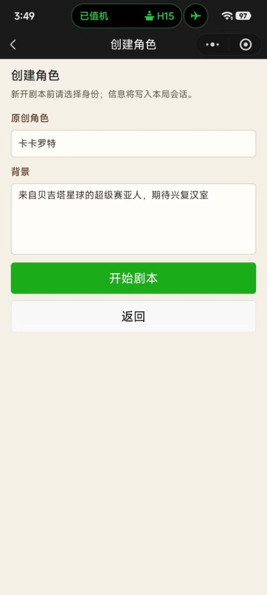
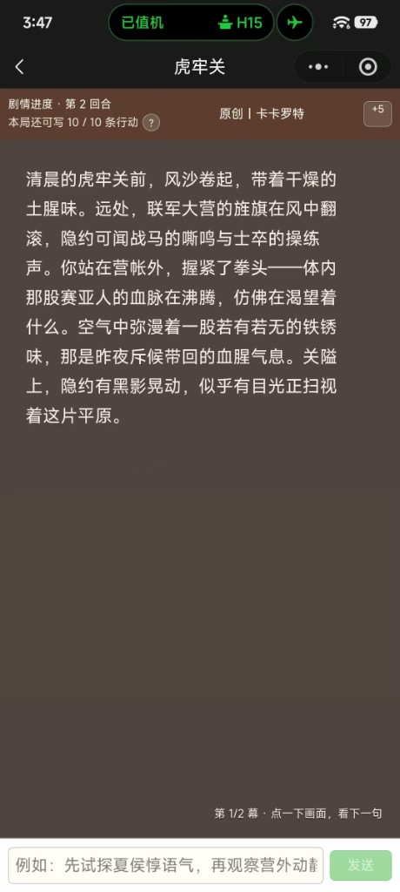
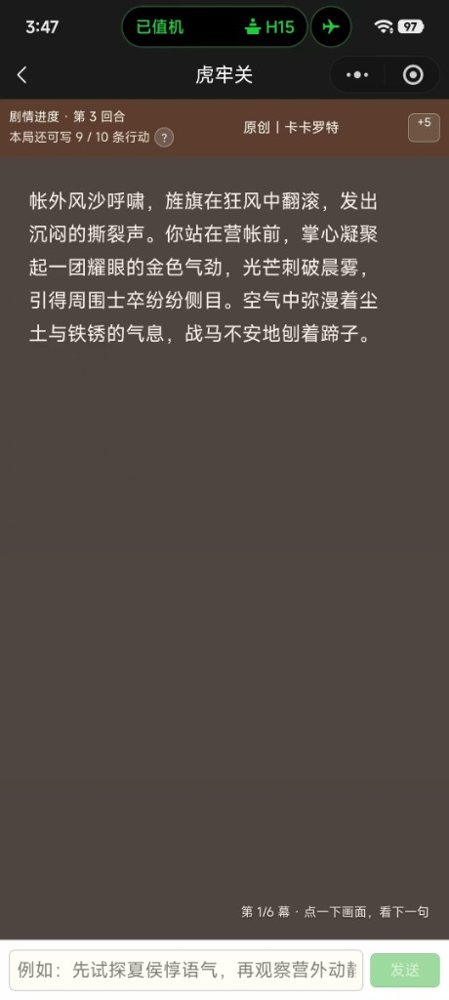
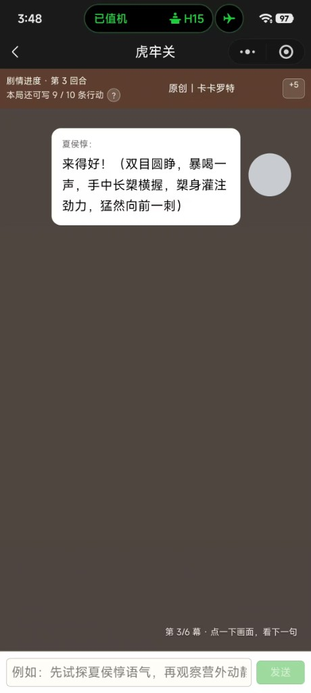
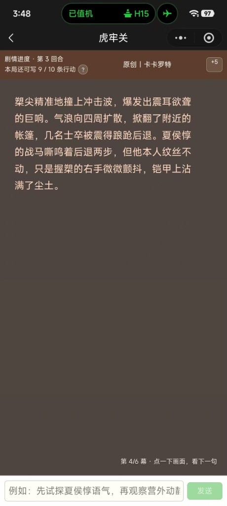
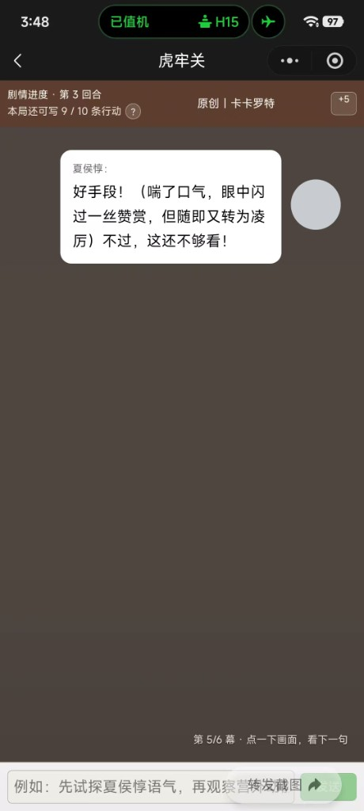
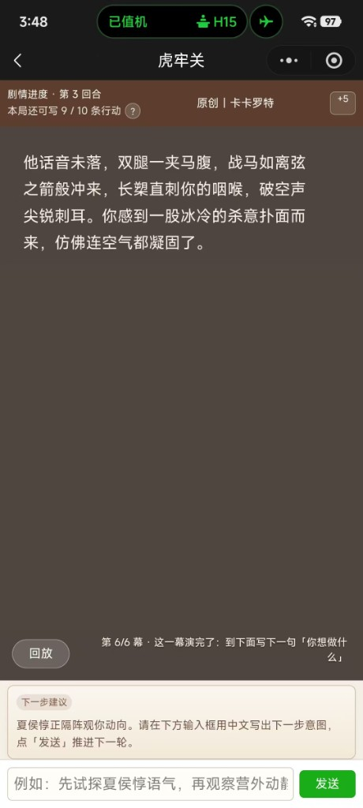

# 字间戏文 — LLM 文字 RPG 导演引擎

基于大语言模型的交互式文字冒险**叙事引擎**：玩家用自然语言输入意图，由 Prompt 导演稿、历史约束、记忆管理等模块驱动模型输出结构化分镜（旁白、对话、`stateChanges`）。

本仓库在引擎之外还包含**微信小程序前端**与**微信云函数**参考实现；若你只想研究或集成引擎，可忽略 `src/frontend/` 与 `src/adapters/wechat/`，从 CLI、HTTP 或自行实现 `SessionStore` 接入即可。

**小程序已上线**（搜索「字间戏文」体验）— 微信侧构建步骤见 [README.weapp.md](./README.weapp.md)。

截图文件位于仓库 [`docs/readme-screenshots/`](./docs/readme-screenshots/)，README 使用**相对路径**引用；推送到 GitHub 后会在仓库首页直接渲染。

## 小程序预览（实际运行效果）

以下截图为 **微信小程序在真机 / 开发者工具预览中的实际界面**，展示「创建原创角色 → 虎牢关舞台分镜 → 旁白与 NPC 对话 → 底部自然语言意图输入与发送」等**上线后的真实展示效果**。  
具体剧情与台词由 LLM 按会话与玩家意图生成，**仅作 UI 与交互演示**，不同局内容可能不同。

### 创建角色

新开剧本前填写**原创角色**名称与背景，信息写入本局会话；点击「开始剧本」进入舞台。



### 虎牢关舞台 · 分镜叙事

舞台顶栏展示**剧情进度、回合数、本局剩余意图次数**等；主区域为分幕旁白 / 描写，可点击画面推进当前幕；底部为中文意图输入框与「发送」。





### NPC 对话与战斗描写

对话以气泡形式呈现；分幕计数（如「第 n/6 幕」）提示当前分镜进度。







### 幕间收束与下一步

一幕结束后可给出**下一步建议**，并继续在输入框中书写意图、点击「发送」进入下一轮。



---

## 快速开始（开源使用者）

### 要求

- Node.js 18+
- LLM API（兼容 OpenAI Chat Completions；默认配置面向通义千问兼容模式 + DeepSeek 备用）

### 安装与配置

```bash
npm install
cp .env.example .env
# 编辑 .env 填入 PRIMARY_LLM_API_KEY 等
npm run build
```

### 命令行游玩

```bash
npm run play
```

### 本地 HTTP（无微信依赖）

```bash
npm run http:interact
# 默认 http://127.0.0.1:8787 — 勿直接暴露公网
```

- `POST /v1/interact`：JSON body  
  - 新开局：`{ "userId": "demo", "scenarioId": "hulaguan", "isNew": true }`（可选 `npcId`、`playerRoleProfile`）  
  - 推进一轮：`{ "userId": "demo", "scenarioId": "hulaguan", "intent": "你的行动描述" }`
- `POST /v1/session/exists`：`{ "userId", "scenarioId" }` 查询是否存在本地会话文件

### 作为库使用

根编译入口 `dist/index.js` 导出 `process`、`buildPrompt`、`SessionStore`、`FileSessionStore`、`getScenariosRoot` 等，详见 `src/index.ts`。

---

## 核心特性

- 自然语言意图驱动单轮 `process` 流水线
- 多档 Prompt Profile（`fast` / `balanced` / `rich`）
- 主备 LLM 路由与超时切换
- 滚动摘要、关键事件、历史一致性提示等记忆与约束模块
- 健壮的 JSON 响应解析与一次结构修复重试

---

## 仓库治理

- **单一事实来源**：请在默认主干上演进，避免长期维护两套平行引擎实现。详见 [docs/GOVERNANCE.md](./docs/GOVERNANCE.md)。
- **贡献与安全**： [CONTRIBUTING.md](./CONTRIBUTING.md) · [SECURITY.md](./SECURITY.md)
- **变更记录**： [CHANGELOG.md](./CHANGELOG.md)
- **第三方与剧本声明**： [NOTICE](./NOTICE)

---

## 文档索引

| 文档 | 内容 |
|------|------|
| [docs/ARCHITECTURE.md](./docs/ARCHITECTURE.md) | 引擎与适配层、数据流 |
| [docs/CONFIGURATION.md](./docs/CONFIGURATION.md) | 环境变量与路径 |
| [docs/scenario-pack.md](./docs/scenario-pack.md) | 剧本包放置、最小文件集、扩展注意点 |
| [docs/scenario-construction-standard.md](./docs/scenario-construction-standard.md) | 剧本字段与质量标准（详细版） |
| [README.weapp.md](./README.weapp.md) | 小程序与云函数构建 |

---

## 项目结构（节选）

```
src/
├── engine/                 # 叙事引擎（Prompt、LLM、解析、记忆）
├── sessions/               # SessionStore、文件会话、配额等
├── adapters/wechat/        # 微信云数据库与内容安全（可选依赖 wx-server-sdk）
├── functions/interact/     # 云函数入口
├── http/                   # 本地 HTTP 演示服务
├── cli/                    # 交互式 CLI
├── frontend/               # Taro 小程序（独立 package.json）
├── types.ts
└── errors.ts
scenarios/hulaguan/         # 示例剧本包（内置虎牢关）
```

---

## 测试

```bash
npm run test:all        # tsc --noEmit + Vitest
npm run test:coverage   # 覆盖率
npm run demo            # 冒烟（含可选真实 LLM，见 src/index.ts）
```

---

## 技术栈（参考）

| 层级 | 技术 |
|------|------|
| 引擎 | TypeScript、Node.js |
| LLM | 通义千问兼容 OpenAI API（主）/ DeepSeek（备）等可配置端点 |
| 小程序 | Taro 4.x、React（见 `src/frontend`） |
| 云函数 | 微信云开发、esbuild 打包至 `cloud-dist/interact` |

---

## License

MIT — 见 [LICENSE](./LICENSE)。

**作者**：[李豫龙](https://github.com/renzaijianghulyl)
