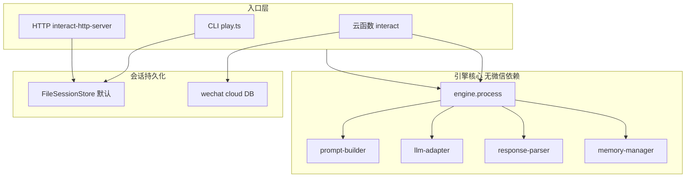

# 架构说明（引擎与适配层）

本文描述「导演 / 叙事引擎」与周边系统的关系，便于开源使用者只依赖核心能力或自行替换存储与入口。

## 分层概览

## 单轮数据流（`process`）

1. 从调用方传入的 `Session` 中取出记忆切片（滚动摘要、关键事件、累计状态等）。
2. `buildPrompt` 组装系统导演稿、历史约束、NPC、关系、意图等。
3. `callLLM` 按主备路由调用模型；失败时切换与重试策略见 `llm-adapter.ts`。
4. `parseResponse` 解析 LLM 输出为结构化分镜与 `stateChanges`；校验失败可触发带提示的重试（见 `engine.ts`）。
5. 历史一致性等校验（如 `historical-context`）在解析后进行。
6. 将合法增量应用到会话中的 HP、关系等，并 `updateMemory` 更新摘要与关键事件。

微信云函数在调用 `process` 前后还会做**内容安全**与**意图配额**等，这些逻辑在 `src/functions/interact/` 与 `src/adapters/wechat/`，不属于引擎最小集。

## 会话抽象（`SessionStore`）

接口定义见 [`src/sessions/session-store-types.ts`](../src/sessions/session-store-types.ts)。

- **默认本地路径**：`session-manager.ts` 委托给 `FileSessionStore` 单例（`getDefaultFileSessionStore()`），会话文件在 `SESSIONS_DIR`（默认项目根下 `.sessions/`）。
- **微信**：[`src/adapters/wechat/cloud-session-store.ts`](../src/adapters/wechat/cloud-session-store.ts) 实现云数据库读写，并导出与 `SessionStore` 对齐的 `wechatCloudSessionStore` 对象。

集成方可注入自己的 `SessionStore`（例如 Redis、Postgres），在自定义 HTTP 或后端服务中调用 `process` 即可。

## 剧本数据

引擎从文件系统读取 `scenarios/<scenarioId>/` 下的 JSON（路径可通过环境变量 `SCENARIOS_ROOT` 覆盖），详见 [剧本包说明](./scenario-pack.md)。

## 相关文档

- [配置说明](./CONFIGURATION.md)
- [仓库治理与发布模型](./GOVERNANCE.md)
