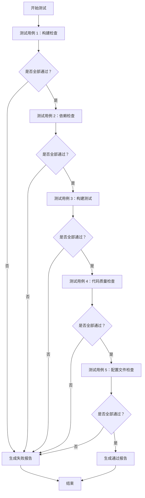

# 微信小程序测试用例

**版本**: v1.0  
**创建时间**: 2026-04-21  
**测试目标**: 验证小程序 MVP 功能完整性

---

## 测试用例 1：构建检查（P0 优先级）

| 编号 | 测试项 | 检查内容 | 预期结果 | 实际结果 | 状态 |
|------|--------|---------|---------|---------|------|
| 1.1 | 小程序 dist 目录 | 检查 src/frontend/dist 是否存在 | 存在 | - | ⏳ |
| 1.2 | 云函数目录 | 检查 cloud-dist/interact 是否存在 | 存在 | - | ⏳ |
| 1.3 | app.js 文件 | 检查 dist/app.js 是否存在 | 存在 | - | ⏳ |
| 1.4 | pages 目录 | 检查 dist/pages 是否存在 | 存在 | - | ⏳ |
| 1.5 | project.config.json | 检查 AppID 是否配置 | 已配置（非 your-appid） | - | ⏳ |

**通过标准**：所有测试项状态为 ✅

---

## 测试用例 2：依赖检查（P0 优先级）

| 编号 | 测试项 | 检查内容 | 预期结果 | 实际结果 | 状态 |
|------|--------|---------|---------|---------|------|
| 2.1 | Taro 依赖 | 检查@tarojs/taro 是否安装 | 已安装 | - | ⏳ |
| 2.2 | 云函数依赖 | 检查 wx-server-sdk 是否安装 | 已安装 | - | ⏳ |
| 2.3 | webpack 版本 | 检查 webpack 是否为 5.91.0 | 5.91.0 | - | ⏳ |

**通过标准**：所有测试项状态为 ✅

---

## 测试用例 3：构建测试（P0 优先级）

| 编号 | 测试项 | 检查内容 | 预期结果 | 实际结果 | 状态 |
|------|--------|---------|---------|---------|------|
| 3.1 | 小程序构建 | 运行 npm run build:weapp | 构建成功（退出码 0） | - | ⏳ |
| 3.2 | 云函数构建 | 运行 npm run build:cloud-interact | 构建成功（退出码 0） | - | ⏳ |
| 3.3 | 单元测试 | 运行 npm run test:unit | 全部通过（37 个用例） | - | ⏳ |

**通过标准**：所有测试项状态为 ✅

---

## 测试用例 4：代码质量检查（P1 优先级）

| 编号 | 测试项 | 检查内容 | 预期结果 | 实际结果 | 状态 |
|------|--------|---------|---------|---------|------|
| 4.1 | TypeScript 编译 | 检查是否有 TS 错误 | 无错误 | - | ⏳ |
| 4.2 | 云函数入口 | 检查 interact/index.js 是否存在 | 存在 | - | ⏳ |
| 4.3 | 云函数依赖 | 检查 interact/node_modules 是否存在 | 存在 | - | ⏳ |

**通过标准**：所有测试项状态为 ✅

---

## 测试用例 5：配置文件检查（P0 优先级）

| 编号 | 测试项 | 检查内容 | 预期结果 | 实际结果 | 状态 |
|------|--------|---------|---------|---------|------|
| 5.1 | app.config.ts | 检查 cloud 配置 | cloud: true | - | ⏳ |
| 5.2 | app.tsx | 检查 Taro.cloud.init | 已调用 | - | ⏳ |
| 5.3 | 页面路由 | 检查 pages/index 和 pages/stage | 都存在 | - | ⏳ |
| 5.4 | 云函数配置 | 检查云函数环境变量配置 | 有配置说明 | - | ⏳ |

**通过标准**：所有测试项状态为 ✅

---

## 测试执行流程



---

## 测试报告格式

### 测试总结

| 测试用例 | 总数 | 通过 | 失败 | 通过率 |
|---------|------|------|------|--------|
| 构建检查 | 5 | - | - | -% |
| 依赖检查 | 3 | - | - | -% |
| 构建测试 | 3 | - | - | -% |
| 代码质量检查 | 3 | - | - | -% |
| 配置文件检查 | 4 | - | - | -% |
| **总计** | **18** | **-** | **-** | **-%** |

### 问题列表

| 编号 | 测试项 | 问题描述 | 严重性 | 修复建议 |
|------|--------|---------|--------|---------|
| - | - | - | - | - |

### 修复优先级

1. **P0 问题**（必须修复）：-
2. **P1 问题**（建议修复）：-

---

## Chief 确认

**请 Chief 确认测试用例**：

**选项 A：测试用例没问题，开始执行**
```
Chief 回复："测试用例没问题，开始执行"
→ Ed 发动子 agent 执行测试
```

**选项 B：需要调整测试用例**
```
Chief 指出需要调整的地方
→ Ed 修改测试用例
→ 重新确认
```

**选项 C：增加测试用例**
```
Chief 提出需要增加的测试项
→ Ed 补充测试用例
→ 重新确认
```

---

**Chief 确认测试用例后，Ed 就发动子 agent 执行测试！** 🦞✨
